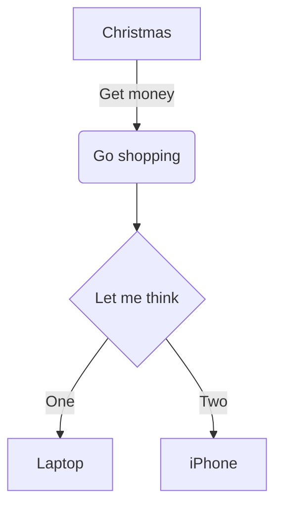

# WYSIWYG Markdown Editor

A WYSIWYG Markdown editor using [CodeMirror](https://codemirror.net/)

### Inline Code

`inline code`

### Fenced Code Block - Typescript

```ts
const state = EditorState.create({
	doc: 'my source code',
	extensions: [
		coolGlow
	]
});
```

### Fenced Code Block - Mermaid


